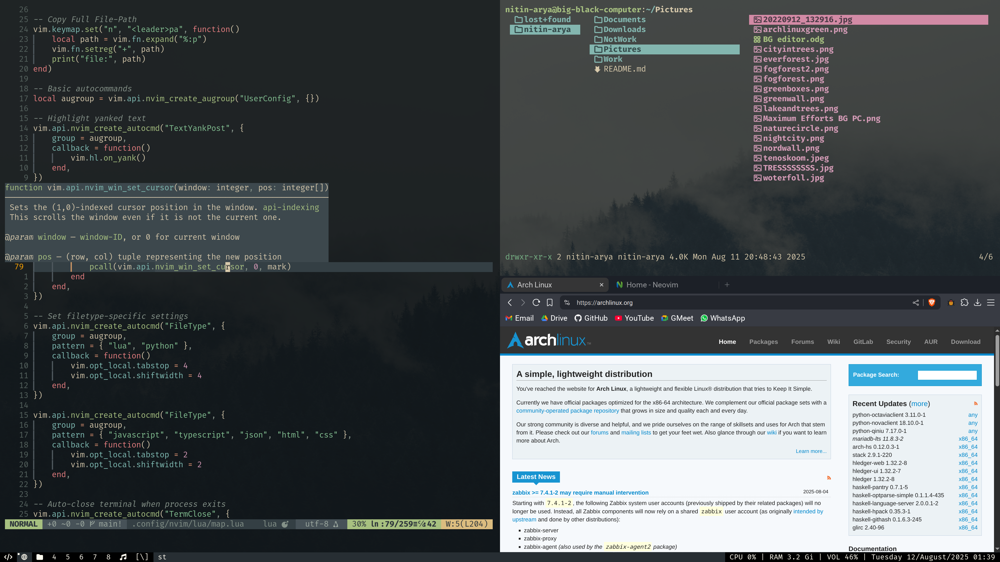
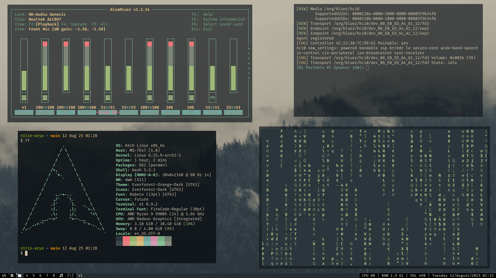
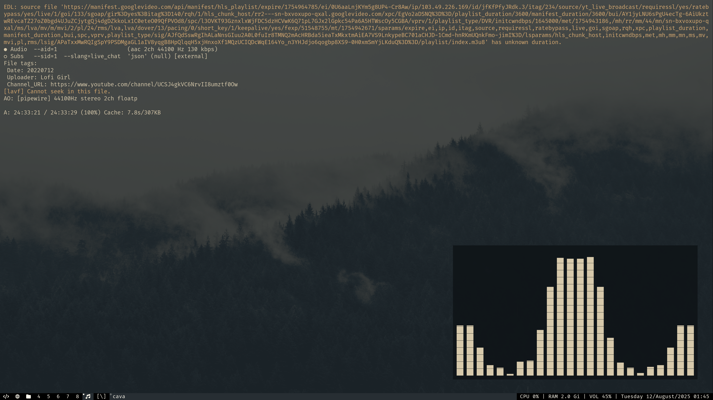

# Dotfiles - A minimal Arch Linux Environment
Essentials only Arch Linux setup

## Screenshots

-my wallpapers are from [this repo](https://github.com/Apeiros-46B/everforest-walls.git)

## Features

- ⚡ **Minimal setup** — no bloat, no unnecessary packages.
- 🛠 **Highly customizable** — every tool can be patched and configured to your liking.
- 🖥 **Lightweight** — low memory and CPU usage.
- ✏  **Developer-friendly** — optimized Neovim configuration with essential plugins.
- 🎨 **Aesthetic** — clean, snappy, distraction-free environment.

## Core Tools

### [Arch Linux](https://archlinux.org/)
- Installed using the Arch install guide, base minimal install with neccesary drivers only.

### [Suckless Tools](https://suckless.org/)
- [DWM](https://dwm.suckless.org/) — Dynamic window manager.
    - Patched with: [always-centre](https://dwm.suckless.org/patches/alwayscenter/) 
- [ST](https://st.suckless.org/) — Simple/Suckless Terminal
    - Patched with: [scrollback](https://st.suckless.org/patches/scrollback/) [alpha-focus](https://st.suckless.org/patches/alpha_focus_highlight/)
- [slstatus](https://tools.suckless.org/slstatus/) — Status monitor for DWM.
- [slock](https://tools.suckless.org/slock/) — Simple screen locker.
- [dmenu](https://tools.suckless.org/dmenu/) — Fuzzy finder for lanching apps.
    - This one is installed from pacman as it doesn't need any customizations.

### [Neovim](https://github.com/neovim/neovim)
- Used with [vim-plug](https://github.com/junegunn/vim-plug)
